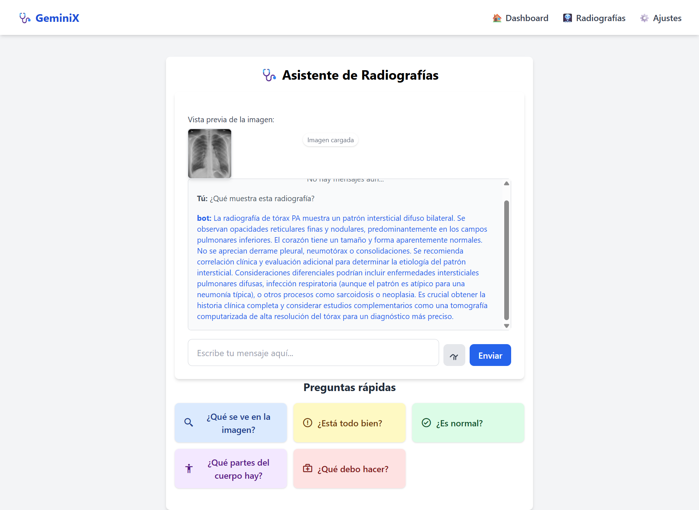

# GeminiX


---

## 🧠 About

**GeminiX** es un sistema inteligente de código abierto desarrollado con **Gemini AI** para la **detección automática de anomalías en radiografías médicas**. Este proyecto combina inteligencia artificial avanzada, visión por computadora y procesamiento de imágenes para asistir a profesionales de la salud en la identificación de patologías de forma rápida, precisa y confiable.

---

## ✨ Características principales

- 🔍 Detección automática de anomalías en imágenes médicas.
- 🤖 Integración con Gemini AI (Google Generative AI).
- ⚙️ Motor de análisis basado en TensorFlow.
- 🌐 API REST construida con Flask.
- 📦 Código limpio, modular y extensible.
- 🖼️ Soporte para carga de imágenes en formato estándar (JPG, PNG, etc).
- 🔓 Totalmente open source y de fácil implementación.

---

## 📸 Demo



*Figura: Detección de anomalías en una radiografía de tórax.*

---

## 🚀 Instalación rápida

### 1. Clonar el repositorio

```bash
git clone https://github.com/Pericena/GeminiX.git
cd GeminiX

### 2. Crear y activar entorno virtual

python -m venv env
source env/bin/activate

Windows:
python -m venv env
env\Scripts\activate.bat


pip install --upgrade pip
pip install numpy==1.26.4 protobuf==4.24.4
pip install Flask google-generativeai tensorflow Pillow

```

Uso
Configurar clave API Gemini AI
Necesitas una clave válida de la API Gemini AI (Google Cloud).

Linux/macOS:
export GOOGLE_API_KEY="TU_API_KEY"

Windows (PowerShell):
setx GOOGLE_API_KEY "TU_API_KEY"

### 3. Probar conexión API Gemini AI

curl "https://generativelanguage.googleapis.com/v1beta/models?key=$GOOGLE_API_KEY"

Ejecutar aplicación Flask
python app.py

Abre en tu navegador: http://localhost:5000

